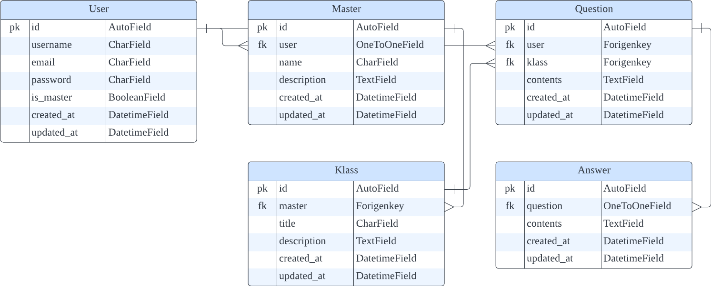

# airklassmissions
Quriously AIR KLASS Python/Django 백엔드 개발자 - 과제 전형

### 배포 주소 ~~[GoTo]~~

### 진행사항 확인 [GoTo](https://round-locust-fc4.notion.site/airklassmissions-ef8c550fbcac42e2a4d64dbfb063b9d0)
- 요구사항 분석, 관련 정보 및 프로젝트 상세 진행사항 기록을 위해 사용

## 과제 해석
서비스를 사용할 수 있는 권한이 있는 client에게 강의를 등록하고 해당 강의에 대한 질문 및 답변을 등록할 수 있는 기능을 제공하는 서비스라고 해석하였습니다.

## 요구사항
> **:pushpin: 체크한 내역으로 구현된 범위를 확인할 수 있습니다.**
- Database
    - [x]  SQLite 사용
    - [ ]  REST API 요구사항에 맞는 DB 구성
        - 수강생, 강사, 강의, 질문, 답변 모델 간 관계 구현
- REST API
    - 사용자 API
        - [ ]  회원가입, 로그인, 로그아웃
        - [ ]  로그인 하지 않은 사용자에 대한 접근 제한
            - 강의 상세내역(질문과 답변 포함) 조회 등 제외
    - 강의 API
        - [ ]  강의 생성
            - 강사만 생성 가능
        - [ ]  해당 강의에 작성된 질문과 답변 조회
    - 질문 API
        - [ ]  강의에 대한 질문 등록
        - [ ]  작성한 질문 내역 삭제
            - 답변이 달린 질문일 경우 삭제 불가
    - 답변 API
        - [ ]  질문에 대한 답변 등록
            - 해당 강의를 생성한 강사만 등록 가능
        - [ ]  작성한 답변 내역 삭제
        - [ ]  작성된 질문 내역 삭제
- Implementation
    - 과제 종료일: 2022년 9월 25일 23:59
    - [x]  Python3 + Django + Django REST Framework 사용
    - [ ]  정상적인 서버 실행 가능하도록 구현
    - [ ]  README.md 작성
        - 서버 실행방법, 구현 스펙, 구현 범위, 과제 구현 과정 등

## 구현

### Tech Stack
    

### 개발 기간
* 2022.09.21. -

> ### ERD

> ### API 명세서 ~~[GoTo]~~

> ### 구현 과정

### Step to run
> window 환경에서 구현 및 실행되었습니다.

## 작성자
All of development : :monkey_face: **Kang Jeonghui**
